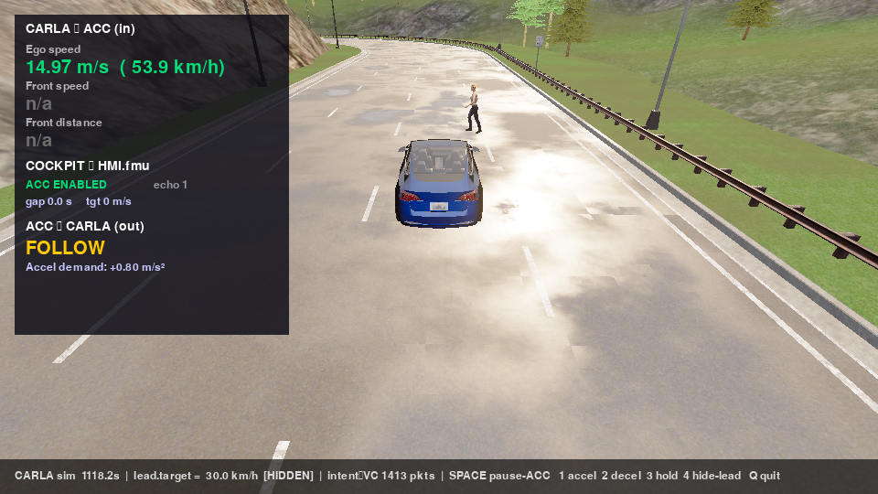

## The missing piece: physics

A [virtual car](/blog/virtual-ecus-with-remotivelabs/) gives you containerized ECUs talking over real signal databases, and even a [real Android Automotive screen](/blog/android-automotive-cuttlefish-docker/). What it doesn't have is a *world*: an adaptive-cruise-control ECU is meaningless without a road, a lead vehicle, and physics that push back.

[CARLA](https://carla.org) provides that world — an open-source, Unreal-based driving simulator with vehicle dynamics, traffic, pedestrians, and sensors. The job: connect CARLA to the vehicle buses so that an ECU publishing `AccelDemand` on CAN actually accelerates a simulated car, and the car's speed comes back as a CAN frame the rest of the stack can consume.

This post covers a bridge design that solves this cleanly — three decisions you can reuse for any simulator-to-bus integration — and, maybe more useful, how to verify such a bridge isn't lying to you.

## Design: a dumb pipe with a smart hook

The bridge's contract is deliberately tiny: flat key-value signals in, flat key-value signals out.

<figure>
<svg viewBox="0 0 720 170" role="img" aria-label="Bridge tick loop: ECU sends commands like ego.throttle to the bridge, which applies them to CARLA; observations like ego.speed_kmh flow back through the bridge to the ECU" style="font-family: var(--font-sans, sans-serif); font-size: 13px;">
  <defs>
    <marker id="arr3" viewBox="0 0 10 10" refX="9" refY="5" markerWidth="7" markerHeight="7" orient="auto-start-reverse">
      <path d="M 0 0 L 10 5 L 0 10 z" fill="var(--border-strong)"/>
    </marker>
  </defs>
  <rect x="20" y="55" width="130" height="60" rx="8" fill="var(--surface-2)" stroke="var(--border-strong)"/>
  <text x="85" y="81" text-anchor="middle" fill="var(--heading)" font-weight="600">ECU / bus</text>
  <text x="85" y="99" text-anchor="middle" fill="var(--text-muted)" font-size="10">CAN signals</text>
  <line x1="150" y1="72" x2="285" y2="72" stroke="var(--accent)" stroke-width="2.5" marker-end="url(#arr3)"/>
  <text x="218" y="60" text-anchor="middle" fill="var(--text-muted)" font-size="11">{"ego.throttle": 0.6}</text>
  <line x1="285" y1="100" x2="150" y2="100" stroke="var(--border-strong)" stroke-width="2.5" marker-end="url(#arr3)"/>
  <text x="218" y="122" text-anchor="middle" fill="var(--text-muted)" font-size="11">{"ego.speed_kmh": 42}</text>
  <rect x="290" y="45" width="150" height="80" rx="8" fill="var(--accent)" fill-opacity="0.12" stroke="var(--accent)"/>
  <text x="365" y="76" text-anchor="middle" fill="var(--heading)" font-weight="700">bridge</text>
  <text x="365" y="96" text-anchor="middle" fill="var(--text-muted)" font-size="10">pure I/O · 50 Hz</text>
  <line x1="440" y1="72" x2="565" y2="72" stroke="var(--accent)" stroke-width="2.5" marker-end="url(#arr3)"/>
  <text x="502" y="60" text-anchor="middle" fill="var(--text-muted)" font-size="11">apply commands</text>
  <line x1="565" y1="100" x2="440" y2="100" stroke="var(--border-strong)" stroke-width="2.5" marker-end="url(#arr3)"/>
  <text x="502" y="122" text-anchor="middle" fill="var(--text-muted)" font-size="11">read observations</text>
  <rect x="570" y="55" width="130" height="60" rx="8" fill="var(--surface-2)" stroke="var(--border-strong)"/>
  <text x="635" y="81" text-anchor="middle" fill="var(--heading)" font-weight="600">CARLA</text>
  <text x="635" y="99" text-anchor="middle" fill="var(--text-muted)" font-size="10">physics · world</text>
</svg>
<figcaption>The whole contract: named values in, named values out, fifty times a second. The bridge never decides anything.</figcaption>
</figure>

Fifty times a second it: reads incoming commands off the transport, applies each to CARLA (`ego.throttle` → that car's throttle, `world.weather.fog_density` → the weather), reads back the observations you declared (speeds, positions, inter-vehicle gaps, sensor values), and publishes them.

Three decisions did the heavy lifting:

**The engine is pure I/O; driving logic is a plug-in.** The bridge itself never decides anything — it applies what arrives and reports what you configured. Anything smart (route following, ACC behavior, scenario timelines) lives in an optional `control.py` hook next to the config, with a three-method interface: `setup()` once after spawn, `step()` every tick to inject or override commands, `observe()` to add custom signals. Generic engine, per-project brains, no forks of the engine anywhere.

**Configuration is a declarative YAML.** Which cars to spawn (and where), which signal maps to which CARLA channel, which relations to publish — one file:

```yaml
transport:
  type: remotive               # bus signals ↔ bridge channels
  inputs:
    - { frame: ACCControl, signal: AccelDemand, state: hero.accel_cmd }
  outputs:
    - { from: hero.speed_kmh, frame: ACCVehicleInfo,      signal: EgoSpeedKmh }
    - { from: gap,            frame: ACCEnvironmentModel, signal: FrontObjDistance }
actors:
  - { role: hero, blueprint: vehicle.tesla.model3, spawn: { policy: explicit, x: 446.0, y: -21.1 } }
  - { role: lead, blueprint: vehicle.audi.tt,      spawn: { policy: ahead_of, ref: hero, distance_m: 30 } }
pairs:
  - { name: gap, actor: hero, ref: lead, obs: distance_to }   # published as "gap"
```

**One bridge, many tenants.** CARLA is heavy; running one instance per project would be miserable. So the bridge is a singleton that watches a directory of case folders: drop a config in and it hot-loads, edit and it reloads, delete and its cars despawn — no restart, so attaching a new project never drops CARLA for the ones already running. The corollary rule: shared process, shared world — *the map belongs to whoever attaches first*.

Here's what the closed loop looks like live — CARLA rendering the world while a HUD overlays the bus signals flowing through the bridge (ego speed in, ACC state and acceleration demand out):


*The bridge at work: the left panel is bus traffic (in and out), the scene is CARLA's ground truth. When these two disagree, the bridge is lying.*

## Verify against ground truth, not vibes

A bridge can look right (car moves, numbers change) while quietly scaling something wrong. The only test that settles it: record the signals off the bus and, at the same moment, read CARLA directly — then compare.

| signal on the bus | bridge said | CARLA truth |
| --- | --- | --- |
| `EgoSpeedKmh` | 30.00 | 30.1 km/h |
| `FrontObjDistance` | 17.90 | 17.86 m |
| `FrontObjSpeedMps` | 8.36 | 8.33 m/s |

All mapped signals within 1 %. Then the end-to-end proof, which I like because it validates the *loop* rather than any single wire: put a compiled controller (an FMU — see the [ACC post](/blog/adaptive-cruise-control-explained/)) in charge of the gap, note that its design parameter sets the minimum following distance, then swap the binary for one with a different parameter and watch what the simulated car does:

| FMU design gap | gap the car actually holds in CARLA |
| --- | --- |
| 11.5 m | 17.9 m |
| 25.0 m | **25.2 m** |

The held gap tracks the parameter inside the controller binary. That only comes out right if bus → bridge → CARLA → bridge → bus all work — commands *and* observations, both directions, with correct units.

The resilience cases got the same treatment: kill CARLA mid-run (back in 18 s via `restart: unless-stopped` — a hard kill aborts the whole process because libcarla throws its timeout on a C++ thread Python can't catch); restart the signal broker (bridge logs "stream dropped — resubscribing", traffic resumes); 15-minute soak at a steady ~25 Hz with flat memory.

## The bugs worth remembering

**A silent 3.6× unit error.** The ACC held a bizarre ~90 m gap and the car kept running away. Cause: feeding the controller km/h where it expected m/s. Units aren't in the type system of a CAN signal — the `.dbc` says "16-bit unsigned, scale 0.01" and nothing else. Every boundary crossing needs an explicit unit check, because nothing else will do it for you.

**Change-based delivery freezes steady streams.** The signal broker delivers on change. Subscribe with `on_change=True` and the stream halts the moment a controller's output goes steady — which looks exactly like a dead bridge. Bursts-then-silence is the signature; subscribing with `on_change=False` is the fix.

**Steer along the road, not the car's nose.** For velocity-railed driving, we initially aligned the velocity vector with the car's heading. First curve: straight off the road, since heading error compounds — the vector must follow the *route tangent* (the road's direction at your position), which physically cannot leave the road. A one-line change and the single biggest quality jump in the whole scenario system.

**`std::bad_alloc` means version mismatch.** CARLA's Python wheel must byte-match the server build. The failure mode is not a version warning but an allocation error deep in libcarla on connect. Pin the wheel next to the server version and never think about it again.

**The clamp that ate the acceleration.** The car accelerated far below its commanded demand — only on a loaded machine. A defensive `dt = min(0.2, elapsed)` clamp in the integration was discarding real elapsed time on slow ticks. Defensive clamps on *time* are lies you tell your integrator; they surface as physics that's wrong only under load, which is the worst kind of intermittent.

## The shape of the thing

What I'd reuse from this design anywhere a simulator meets a signal bus:

1. **Pure-I/O engine + declarative mapping + optional logic hook.** The engine never grows project features; projects never fork the engine.
2. **A watched-directory singleton** for expensive shared resources — hot attach/detach beats restart coordination across teams.
3. **Verification = same quantity, two paths.** Bus signal vs. direct simulator read, plus one closed-loop test whose outcome depends on the whole chain being right.
4. **Unit checks at every boundary**, because the wire format won't carry them for you.
